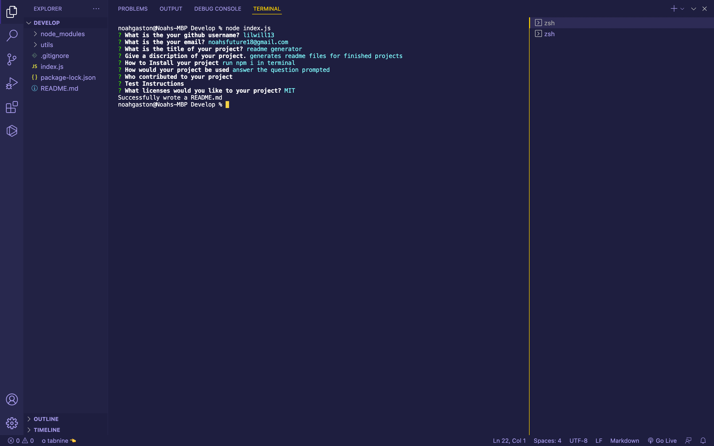

# readme generator
## Description
generates readme files for finished projects

## Installation

- run npm i in terminal

## Usage

- answer the question prompted 

## Contributing

- 

## Test-Instructions

- 

## Visuals
 

## License

- MIT

## Questions 

- Github: lilwill13

- noahsfuture18@gmail.com

## Tabel of contents

- [Description](#description)

- [Installation](#installation)

- [Usage](#usage)

- [Contributing](#contributing)

- [License](#license)

- [Test-Instructions](#test-instructions)

- [Questions](#questions)